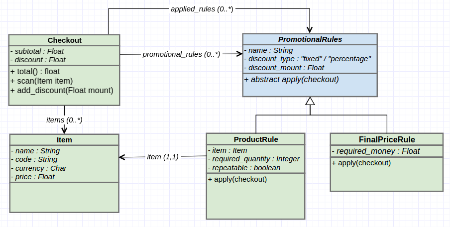

# The Problem

  Our client is an online marketplace, here is a sample of some of the products available on our site:


  |Product code  | Name                   | Price   |
  |--------------|:-----------------------|---------|
  |001           | Lavender heart         | £9.25   |
  |002           | Personalised cufflinks | £45.00  |
  |003           | Kids T-shirt           | £19.95  |

  Our marketing team want to offer promotions as an incentive for our customers to purchase these items.
  If you spend over £60, then you get 10% off of your purchase. If you buy 2 or more lavender hearts then the price drops to £8.50.
  Our check-out can scan items in any order, and because our promotions will change, it needs to be flexible regarding our promotional rules.
  The interface to our checkout looks like this (shown in Ruby):
  ```ruby
  co = Checkout.new(promotional_rules)
  co.scan(item)
  co.scan(item)
  price = co.total
  ```
  Implement a checkout system that fullfills these requirements.
  ```
  Test data                   
  ----------------------------
  Basket: 001,002,003
  Total price expected: £66.78

  Basket: 001,003,001
  Total price expected: £36.95

  Basket: 001,002,001,003
  Total price expected: £73.76
  ```

# The Proposal
  

### Item
  + It's a very dummy class, only carry items data.

### PromotionalRule
  + It's a _pseudo abstract class_, this define any common methods for two types of promotional rules.
  + The `discount_type` attribute can be only *"fixed"* or *"percentage"* strings.
  + `apply(chekout)` must be implemented at subclasses.

### ProductRule
  + This has a `item` reference that apply yours promotional discounts.
  + `required_quantity` references the minimum amount of items required for the promotion to be applicable.
  + `repeatable` flag indicating if after the minimum amount needed can continue to apply with the rest of the products.
  + `apply(chekout)` this apply discounts for your item on checkouts, modify your `discount` mount.

### FinalPriceRule
  + `required_money` references the minimum amount of spend required for the promotion to be applicable.
  + `apply(chekout)` this apply discounts for total calculated, in other words, after that products discounts be applied, modify chekout discount mount, adding the percentage to discount over total.

### Checkout
  + `subtotal` references the total of items prices.
  + `discount` references the total of discount to reduce at subtotal.
  + `applied_rules` references a list with promotional rules previously applied, to avoid applying it indefinitely.
  + `promotional_rules` references a list with promotional rules defined for your checkout.
  + `items` this keeps references for scanned items.
  + `scan(item)` add item to item list, update `subtotal`, and update `discount` if neccesary.
  + `total` return spend mount with items discount applieds, and then apply final price rules, if any present.
  + `add_discount`, helper method to update discount.


# Testing
  The testing suite works with `RSpec`, `FactoryGirl` and `Faker`.

  To be able to work with *FactoryGirl*, de `initialize` methods has been commented, because the gem needs that these be **empty**.
  
  On the other hand, the pertinent cases of the statement can be seen through the factories and test case for particular checkout. The rest of the automatic testing is part of the TDD.
